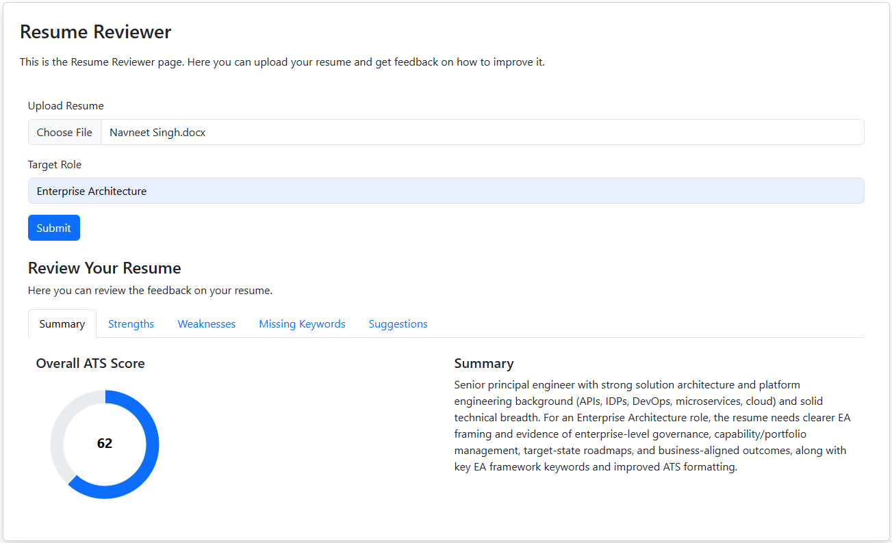

# Resume Reviewer
An enterprise-style AI Resume Analyzer built using Spring AI and OpenAI.

This project evaluates resumes against a target job role and provides structured, ATS-aware feedback.

## Problem Statement
Recruiters spend limited time reviewing resumes.

Candidates often miss important keywords or fail ATS screening.

This application:
- Parses PDF/DOCX resumes 
- Analyzes them using an LLM 
- Returns structured evaluation with scoring 
- Suggests improvements

## Key Features
- Resume upload (PDF/DOCX)
- Text extraction using Apache Tika 
- AI-powered evaluation 
- Structured JSON output 
- Role-based scoring 
- Deterministic scoring configuration

## Tech Stack
- Java 21
- Spring Boot 4.x.x
- Spring AI
- OpenAI
- Apache Tika
- Jackson
- Maven

## API Endpoint
**POST** `/resume/review`
Form Data:
- file → Resume (PDF/DOCX)
- targetRole → Example: Java Backend Developer, AI Engineer

### Sample cURL Request
```bash
    curl --location 'http://localhost:8080/resume/review' \
    --form 'file=@"/C:/Users/Admin/OneDrive/Desktop/Navneet Singh_Resume_2025.pdf"' \
    --form 'target="AI Engineer"'
```

### Sample Response
```JSON
{
  "overallScore": 82,
  "strengths": [
    "Strong Spring Boot experience",
    "Good project descriptions"
  ],
  "weaknesses": [
    "Missing measurable achievements"
  ],
  "missingKeywords": [
    "Docker",
    "Kubernetes"
  ],
  "suggestions": [
    "Add quantified impact metrics",
    "Highlight cloud deployment experience"
  ],
  "summary": "Solid backend profile with opportunities to improve ATS alignment."
}
```

## Frontend UI


## Future Improvements
- Resume vs Job Description embedding comparison
- Token usage logging
- Conversation memory
- Role-based evaluation rubric
- Dockerization
- Frontend UI